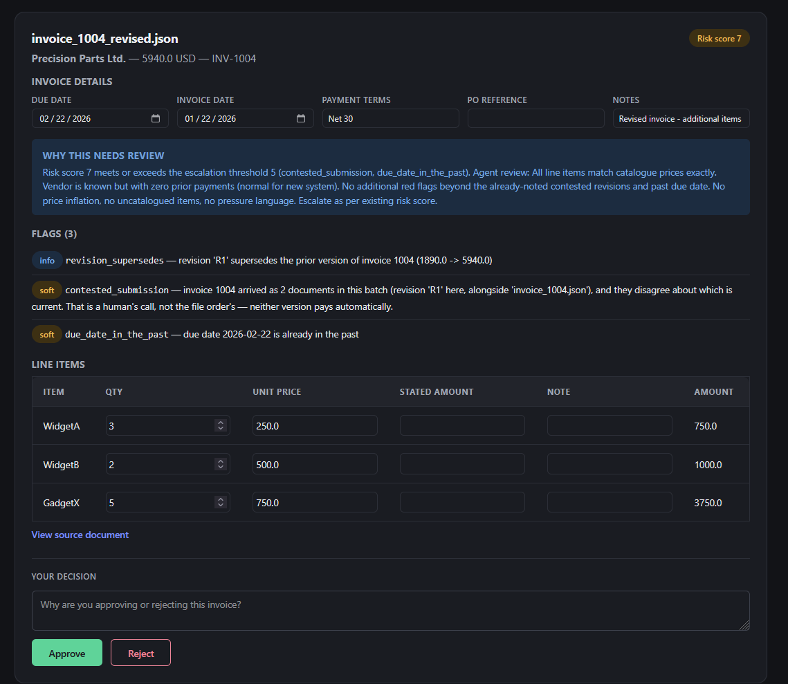
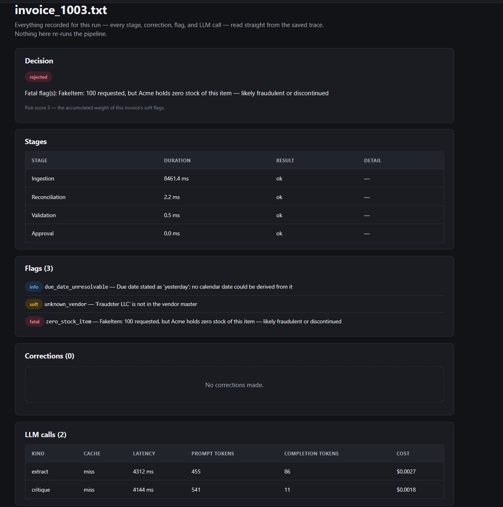
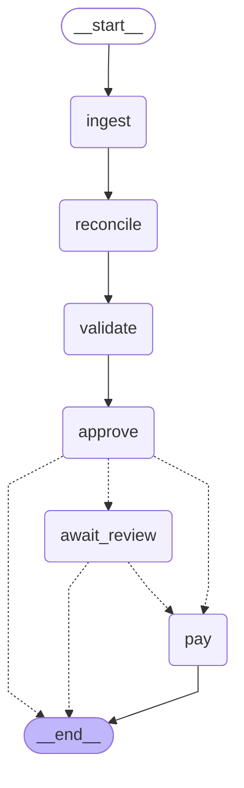

# Invoice Processing Automation

Acme Corp processes supplier invoices by hand: a clerk reads the document, checks items
against inventory, chases a VP for approval by email, then pays. It costs **$2M/year**,
carries a **30% error rate**, and takes **5 days** per invoice.

This is an agentic pipeline that runs that whole workflow instead — **ingestion**
(document in, structured invoice out, via an LLM extraction step that critiques and
retries its own reading), **validation** (deterministic, against the inventory catalogue —
a lookup against ground truth has no business being probabilistic), **approval**
(deterministic rules plus a tool-calling LLM that may only add caution, never overrule
one), and **payment** (mocked, idempotent) — with every judgment call recorded as an
auditable correction, flag, or decision rather than a silent guess. `CONTEXT.md` has the
full vocabulary; the numbers above are what every feature here is measured against.

## What it does to those numbers

`python main.py --invoice_dir=data/invoices`, over the 20 provided documents — 16 distinct
invoices, the rest duplicates, PDF/text twins, and one revision. Dollars are counted **per
invoice, not per document**: one obligation is one number however many files describe it.

| | |
| ---- | ---- |
| Paid with no human involved | **5 invoices, $27,225** |
| Held for a reviewer, with the reason stated | 5 invoices, $30,383 |
| Refused outright | 5 invoices, $168,313 — plus INV-1009, whose negative quantity is a data defect rather than an amount |
| Findings behind those calls | 12 fatal, 30 soft, and 5 audited corrections to what the documents literally said |
| Per document | **17 seconds** and **$0.017** of Grok tokens, against the 5-day, ~$20-per-invoice manual baseline |

Outcomes are from the keyless run, which replays recorded responses and so is byte-stable —
run it yourself and you get this table. Cost and latency come from a live Grok run's own
traces (91 billed calls, $0.33 for the batch), the same data the dashboard's drill-down shows
per stage.

A live run does not reproduce the table exactly, and that is worth stating rather than
hiding. Measured against one: 17 of the 20 documents reach the same **decision**; three move
(`invoice_1010.txt` and `invoice_1016.json` from escalated to rejected, `invoice_1012.txt`
from approved to escalated). Every one of those moves is toward *more* caution, which is what
the caution ratchet ([ADR-0004](docs/adr/0004-caution-ratchet-for-approval.md)) exists to
guarantee — the model may add scrutiny and may never remove it. Payment was identical in both
runs: the same 5 invoices, the same $27,225. What varies is how much extra scrutiny a
borderline invoice attracts; what does not vary is which invoices are safe to pay.

Two things worth reading carefully before treating the dollar figures as a result:

**The refused total is concentrated.** $100,000 of that $168,313 is one invoice — INV-1003,
which bills a zero-stock `FakeItem` and is the corpus's deliberate fraud case. The remaining
four refusals total $68,313. A single well-chosen test invoice is doing most of the work in
that number, and it would be dishonest to present it as steady-state throughput.

**The corpus is adversarial by construction.** The brief's sample data exists to exercise
failure modes, so roughly half of it carries a real defect; a production AP inbox is
overwhelmingly clean and the pass rate would invert. What generalises from this run is not
the ratio — it is that **$198,696 did not move without a rule or a human authorising it**,
and that the per-invoice cost of getting there was $0.017.

## Install

```bash
python -m venv .venv
source .venv/Scripts/activate    # Windows (Git Bash); macOS/Linux: source .venv/bin/activate
# PowerShell: .venv\Scripts\Activate.ps1
pip install -e ".[dev]"
```

Activation only takes effect if you `source` it (or `.` it) — running the script directly
spawns a subshell that exits immediately and changes nothing in your current one. Confirm it
worked before installing: `which python` should point inside `.venv`, not a system Python.

No API key needed. Without one the system uses a fake reasoning provider that replays
recorded responses, so a clean clone runs the tests and the CLI as-is
([ADR-0001](docs/adr/0001-llm-is-the-only-network-dependency.md)). Copy `.env.example` to
`.env` and set `XAI_API_KEY` to use Grok for real — `Settings.from_env()` loads `.env`
automatically (`python-dotenv`), so no manual export step is needed; a real environment
variable you've already set always takes precedence over what's in the file.

```bash
pytest          # no network, no credentials — green on a clean clone
mypy            # strict, src and tests
```

## Catalogue seed

The inventory catalogue (SQLite: item, stock, expected price, known vendors) creates and
seeds itself on first run. To reset it deliberately:

```bash
python main.py --seed-catalogue
```

## Single-invoice run

```bash
python main.py --invoice_path=data/invoices/invoice_1001.txt
python main.py --invoice_path=data/invoices/invoice_1013.json   # aggregated stock exceeded: rejected
```

An escalated invoice pauses rather than failing — the run reports the document name to
resume with:

```bash
python main.py --invoice_path=data/invoices_extra/invoice_9003_threshold_over.json   # over $10K: escalated
python main.py --resume=invoice_9003_threshold_over.json --decision=approved --reason="VP confirmed by phone"
```

## Batch run

```bash
python main.py --invoice_dir=data/invoices
```

One bad document never stops the rest; a summary is reported at the end (approved,
rejected, escalated, failed counts). This is the same code path
[the eval harness](docs/adr/0006-recorded-responses-for-tests.md) drives over the golden set.

This runs with no key. The deterministic (JSON/CSV/XML) documents never needed the model
([ADR-0009](docs/adr/0009-deterministic-parsing-for-structured-formats.md)); the text and
PDF ones are answered from real Grok responses recorded once and bundled with the package,
so the whole provided corpus reaches a decision on a clean clone. `python
scripts/record_cassettes.py` plus a real `XAI_API_KEY`, or `--provider grok`, re-records
against the live model instead.

One honest limitation of that keyless path: recordings are keyed on a document's filename
*stem*, so INV-1011's and INV-1012's PDF and text twins replay the same answer. Keyless,
those pairs therefore demonstrate reconciliation's *identical duplicate* branch (paid once,
info flag) rather than the enrichment and contradiction branches they exist to exercise —
where the text twin carries fields the PDF's layout dropped. Those branches are covered by
`tests/test_reconciliation.py` against scripted extractions, and a run with a real key
shows them on the sample data itself.

## Dashboard

```bash
python -m invoice_automation.web    # http://127.0.0.1:8000
```

### The review queue



`invoice_1004_revised.json`, held. Two documents arrived for invoice INV-1004 and they
disagree about which is current, so neither pays until a **reviewer** says which one is
([ADR-0013](docs/adr/0013-contested-submissions-detected-before-the-batch-runs.md)). The
**risk score** of 7 crossed the escalation threshold of 5 on soft flags alone — no single
rule stopped this invoice. Every field is editable, and an edit writes a **correction**
rather than overwriting silently ([ADR-0012](docs/adr/0012-reviewer-edits-via-checkpoint-update.md)).

### One run, end to end



`invoice_1003.txt` — the $100,000 invoice from "Fraudster LLC" billing 100 units of an item
Acme holds no stock of. Read the stage timings: **ingestion** took 8.5 seconds because the
model read a text document and a **critic** checked it, while **validation** and **approval**
took under a millisecond between them. That split is the whole design
([ADR-0009](docs/adr/0009-deterministic-parsing-for-structured-formats.md)) — the model reads,
deterministic code decides. Nothing here re-runs the pipeline; it is read from the saved trace.

Pipeline view (with a click-to-upload control — pick one or several files from
`data/demo_uploads/` to see it work immediately, or any of `data/invoices/`), ledger, and
the review queue for escalated invoices. No Node toolchain
required to run it — the React/Vite production bundle is committed under
`src/invoice_automation/static/` and served as static files
([ADR-0008](docs/adr/0008-react-with-committed-bundle.md)). To rebuild it after changing
the front end:

```bash
python scripts/rebuild_dashboard.py    # npm install && npm run build, then stamps the bundle
```

`scripts/check_bundle_fresh.py` (run in `pytest`) fails if the committed bundle and
`frontend/src` disagree — a source change with no matching rebuild is caught rather than
shipped silently stale.

Iterating on the front end itself: run the backend (`python -m invoice_automation.web`)
and, in `frontend/`, `npm install && npm run dev` for hot-module reload against it
(`vite.config.ts` proxies `/runs`, `/reviews`, `/status`, `/impact`, and `/events` to
`:8000`). Still run `rebuild_dashboard.py` before committing — the dev server never
writes to `src/invoice_automation/static/`.

## Docker

No local Python (or Node) installation needed at all:

```bash
docker build -t invoice-automation .
docker run -p 8000:8000 invoice-automation                          # dashboard
docker run invoice-automation python main.py --invoice_dir=data/invoices   # CLI, one-off
```

Runs with no API key (the fake provider) exactly like the local path above; pass
`-e XAI_API_KEY=...` to use Grok for real. The documented local path (`pip install -e
".[dev]"`, no Docker) still works unchanged — this is an alternative, not a replacement.

## Commit messages

`git config core.hooksPath .githooks` (one-time, local to this clone) turns on a
`commit-msg` hook that rejects a commit whose subject isn't Conventional Commits
(`type(scope): subject`, type one of `feat|fix|refactor|test|docs|chore|perf|build|ci`)
or is a placeholder like `wip`/`fix stuff`. `git config commit.template .gitmessage`
makes `git commit` (no `-m`) open with the format and a reminder to write *why*, not
*what* — the diff already shows what.

## Where things live

| Path | What it is |
| ---- | ---------- |
| [REQUIREMENTS.md](REQUIREMENTS.md) | The original brief, unmodified |
| [docs/SPEC.md](docs/SPEC.md) | The spec — problem, 91 user stories, scope boundaries |
| [CONTEXT.md](CONTEXT.md) | Domain glossary — the vocabulary this codebase speaks |
| [docs/adr/](docs/adr/) | Architecture decisions, each with its cost stated |
| [data/invoices/](data/invoices/) | The 16 provided sample invoices, untouched |
| [data/invoices_extra/](data/invoices_extra/) | 6 authored fixtures reaching scenarios the provided data doesn't |
| [data/demo_uploads/](data/demo_uploads/) | 4 files for trying the dashboard's upload control — one clean approve, one stock mismatch, one over-threshold escalation, one fatal rejection |

## Design in one table

| Area | Decision | Why |
| ---- | -------- | --- |
| Reasoning engine | Grok via xAI's OpenAI-compatible API, behind a provider interface | The only real network call; everything Acme-side is mocked ([ADR-0001](docs/adr/0001-llm-is-the-only-network-dependency.md)) |
| Ingestion | Structured formats parsed deterministically; the model reads only what needs judgment | A JSON invoice is already extracted; sending it to an LLM adds cost and a hallucination risk ([ADR-0009](docs/adr/0009-deterministic-parsing-for-structured-formats.md)) |
| Orchestration | LangGraph — nodes, conditional edges, cycles, checkpointer | The workflow is a cyclic graph, not a pipeline ([ADR-0002](docs/adr/0002-langgraph-for-orchestration.md)) |
| Agents | Two LLM-reasoning stages, not five — extraction (with a critique/retry loop) and approval (tool-calling, with a caution ratchet); reconciliation, validation, and payment are deterministic on purpose | The brief's "reflection or critique loop": extraction re-checks its own output against the source document and retries on a real problem ([`_critique`](src/invoice_automation/extraction.py)); approval reasons over the invoice and flags before deciding ([ADR-0004](docs/adr/0004-caution-ratchet-for-approval.md)) |
| Bad data | Auditable corrections: raw, value, reason, confidence | A 30% error rate is not fixed by being confidently wrong more quietly |
| Approval | Deterministic rules, LLM may only add caution | Invoice text is untrusted input ([ADR-0004](docs/adr/0004-caution-ratchet-for-approval.md)) |
| Duplicates | Registry keyed on invoice number; revisions supersede | INV-1011 arrives twice; INV-1004 has a revision worth $4,050 |
| Contested versions | A batch is scanned for revision collisions before the first document runs; both versions held | Sorted order used to pay the superseded $1,890 before the $5,940 revision was read ([ADR-0013](docs/adr/0013-contested-submissions-detected-before-the-batch-runs.md)) |
| Escalation | Graph interrupts, checkpoints, resumes on human action | Real human-in-the-loop, not a mock of one ([ADR-0005](docs/adr/0005-interrupt-and-resume-for-escalation.md)) |
| Interface | CLI (as specified) plus a React dashboard served by FastAPI | Pipeline, review queue, ledger ([ADR-0008](docs/adr/0008-react-with-committed-bundle.md)) |
| Tests | Unit, recorded cassettes, evals | Green on a clean clone with no API key ([ADR-0006](docs/adr/0006-recorded-responses-for-tests.md)) |

## Architecture

Generated from the live `StateGraph` (`graph.build_graph`) by
`python scripts/generate_diagram.py` — this is the actual graph `run_invoice` executes,
not a drawing of it, so it cannot drift from the code.

<!-- ARCHITECTURE_DIAGRAM:START -->



<!-- ARCHITECTURE_DIAGRAM:END -->

## Tests, in three layers

Per [ADR-0006](docs/adr/0006-recorded-responses-for-tests.md):

1. **Unit** — parsers, validation, reconciliation, FX, no LLM: the bulk of the suite.
2. **Recorded** — `tests/cassettes/`, real Grok request/response pairs captured once and
   replayed offline (`tests/test_cassettes.py`). Recording is one documented command,
   because it needs a key:
   ```bash
   python scripts/record_cassettes.py
   ```
   `FakeProvider` (no key needed, ever) and cassette replay share one implementation —
   recording just points the same loader at `tests/cassettes/` instead of the package's
   bundled sample responses. `scripts/check_cassettes_fresh.py` (also run in `pytest`)
   catches a cassette recorded against a prompt or schema that has since changed.
3. **Evals** — `python -m invoice_automation.evals` scores the golden set (16 provided
   invoices plus the authored fixtures) on decision agreement and field accuracy, so a
   prompt change reports "94% to 81%" instead of one opaque red test.

The test suite never calls the real Grok API — it runs entirely against `FakeProvider`/cassette
replay regardless of whether `XAI_API_KEY` is set. To check the live integration, run the CLI
manually with `--provider grok` and a real key (see above).
